Differential experssion analysis label free proteomics data
===========================================================

Introduction
------------

This tool is developed to automate downstream statistical analysis of
quantitative proteomics (label-free) datasets generated by MaxQuant.

Input
-----

-   MaxQuant **proteinGroups.txt** file that **Must** contain *Gene
    name* and *Protein IDs* column.
-   An **experiment design table**: A tab separated file **only**
    containing **three** columns namely: "*label*", "*condition*",
    "*replicate*". The column names are **case sensitive**

<table>
<thead>
<tr class="header">
<th align="left">label</th>
<th align="left">condition</th>
<th align="right">replicate</th>
</tr>
</thead>
<tbody>
<tr class="odd">
<td align="left">H1</td>
<td align="left">CD34High</td>
<td align="right">1</td>
</tr>
<tr class="even">
<td align="left">H2</td>
<td align="left">CD34High</td>
<td align="right">2</td>
</tr>
<tr class="odd">
<td align="left">H3</td>
<td align="left">CD34High</td>
<td align="right">3</td>
</tr>
<tr class="even">
<td align="left">H4</td>
<td align="left">CD34High</td>
<td align="right">4</td>
</tr>
<tr class="odd">
<td align="left">L1</td>
<td align="left">CD34Low</td>
<td align="right">1</td>
</tr>
<tr class="even">
<td align="left">L2</td>
<td align="left">CD34Low</td>
<td align="right">2</td>
</tr>
<tr class="odd">
<td align="left">L3</td>
<td align="left">CD34Low</td>
<td align="right">3</td>
</tr>
<tr class="even">
<td align="left">L4</td>
<td align="left">CD34Low</td>
<td align="right">4</td>
</tr>
</tbody>
</table>

<table>
<thead>
<tr class="header">
<th align="left">label</th>
<th align="left">condition</th>
<th align="right">replicate</th>
</tr>
</thead>
<tbody>
<tr class="odd">
<td align="left">H1</td>
<td align="left">CD34High</td>
<td align="right">1</td>
</tr>
<tr class="even">
<td align="left">H2</td>
<td align="left">CD34High</td>
<td align="right">2</td>
</tr>
<tr class="odd">
<td align="left">H3</td>
<td align="left">CD34High</td>
<td align="right">3</td>
</tr>
<tr class="even">
<td align="left">H4</td>
<td align="left">CD34High</td>
<td align="right">4</td>
</tr>
<tr class="odd">
<td align="left">L1</td>
<td align="left">CD34Low</td>
<td align="right">1</td>
</tr>
<tr class="even">
<td align="left">L2</td>
<td align="left">CD34Low</td>
<td align="right">2</td>
</tr>
<tr class="odd">
<td align="left">L3</td>
<td align="left">CD34Low</td>
<td align="right">3</td>
</tr>
<tr class="even">
<td align="left">L4</td>
<td align="left">CD34Low</td>
<td align="right">4</td>
</tr>
</tbody>
</table>

**Note:** The label column must match the lables present in **LFQ
Intensity** columns of **proteinGroups.txt** file. For example, include
**"H1"** in lable column if **"LFQ Intensity H1"** column present in
your proteinGroups file.

Advanced Options
----------------

#### Significant protein filtering criteria

-   Adjusted p-value cutoff: default is **0.05**
-   Log fold change cutoff: default is **1**

#### Missing value imputation options

-   **Perseus-type:** This method is based on popular missing value
    imputation procedure implemented in *Perseus* software by MaxQuant
    team. The missing values are replaced by random numbers drawn from a
    normal distribution of *1.8* standard devation down shift and with a
    width of *0.3* of each sample.
-   **bpca:** Bayesian missing value imputation
-   **knn:** Missing values replace by nearest neighbour averaging
    technique
-   **QRILC:** A missing data imputation method that performs the
    imputation of left-censored missing data using random draws from a
    truncated distribution with parameters estimated using quantile
    regression.
-   **MinDet:** Performs the imputation of left-censored missing data
    using a deterministic minimal value approach. Considering a
    expression data with n samples and p features, for each sample, the
    missing entries are replaced with a minimal value observed in that
    sample. The minimal value observed is estimated as being the q-th
    quantile (default q = 0.01) of the observed values in that sample.
-   **MinProb:** Performs the imputation of left-censored missing data
    by random draws from a Gaussian distribution centred to a minimal
    value. Considering an expression data matrix with n samples and p
    features, for each sample, the mean value of the Gaussian
    distribution is set to a minimal observed value in that sample. The
    minimal value observed is estimated as being the q-th quantile
    (default q = 0.01) of the observed values in that sample. The
    standard deviation is estimated as the median of the feature
    standard deviations. Note that when estimating the standard
    deviation of the Gaussian distribution, only the peptides/proteins
    which present more than 50% recorded values are considered.
-   **min:** Replaces the missing values by the smallest non-missing
    value in the data.
-   **zero:** Replaces the missing values by **0**.

#### False Discovery Rate (FDR) correction option

-   Benjamin Hocheberg (BH) method
-   t-statistics correction: Implemented in
    [fdrtools](http://strimmerlab.org/software/fdrtool/)

#### Data pre-filtering criteria

Following data-cleaning criteria is applied before performing
differential experssion analysis.

-   Remove potential contaminants
-   Remove reverse sequences
-   Remove proteins identified only by sites
-   Remove proteins identified/quantified by a single Razor or unique
    peptide
-   Remove observation with high proportion of missing values (intensity
    values must be present at least 2 out of three replicates)

#### Differential expression analysis

Protein-wise linear models combined with empirical Bayes statistics are
used for the differential expression analysis. We use a *bioconductor*
package *limma* to carry out the analysis using automatically generates
the contrasts from experiment design table provided by the user allowing
the generation of results for all possible comparisons. It also take
into account user defined cutoffs to filter significantly different
proteins.

Output
------

#### Result table

-   **LFQ Results Table:** Includes names (Gene names), Protein Ids, Log
    fold changes/ ratios (each pairwise comparisons), Adjusted
    *p-values* (applying FDR corrections), *p-values*, boolean values
    for significance, average protein intensity (log transformed) in
    each sample.

#### Result Plots

1.  **PCA plot**: A Principal Componant Analysis(PCA) is a technique
    used to emphasize variation and bring out strong patterns in a
    dataset. In brief, the more similar 2 samples are, the closer they
    cluster together. Of course, this means that biological replicates
    (and in particular technical replicates) should cluster tightly
    together. For further information, here are a few links, which
    explains the principals of PCAs:
    [Info](ttp://ordination.okstate.edu/PCA.htm) and [Basic
    introduction](http://setosa.io/ev/principal-component-analysis/)

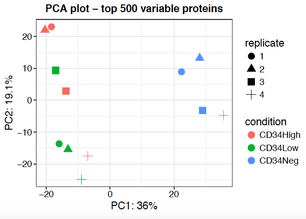

1.  **Heatmap**: The heatmap representation gives an overview of all
    significant/differentially expressed proteins (rows) in all samples
    (columns). This visualization allows the identfication of general
    trends such as if one sample or replicate is highly different
    compared to the others and might be considerd as an outlier.
    Additionally, the hierarchical clustering of samples (columns)
    indicates how related the different samples are and
    hierarchicalclustering of proteins (rows) identifies similarly
    behaving proteins. This analysis divides differncially expressed
    proteins into *six* clusters/groups. User also have option to
    download protein information from individual cluster.

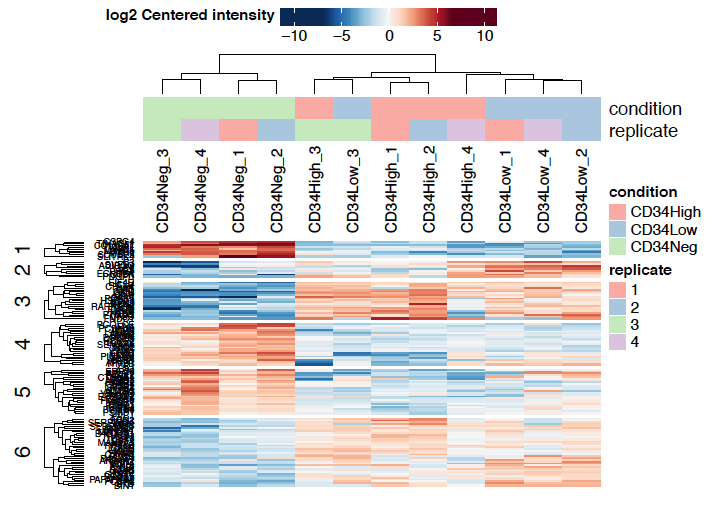

1.  **Volcano plot**: A volcano plot is generated for each pairwise
    comparison. It is a graphical visualization by plotting the “Fold
    Change (Log2)” on the x-axis versus the –log10 of the “ *p-value*”
    on the y-axis. Interesting candidate proteins are located in the
    left and right upper quadrant. User can toggle the display name
    checkbox to highlight names of differencially expressed proteins or
    use 'adjusted *p-value*' as y-axis. Importantly, user can highlight
    protein or their interest (colored moroon) by selecting the row from
    "**LFQ Results Table**". This highlighted plot can be downloaded
    using " *Save Highlited Plot*" button.

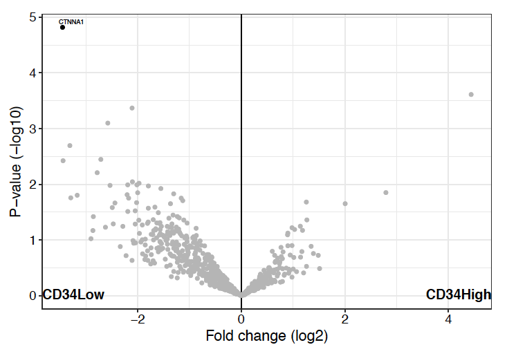

#### QC plots

1.  **Sample Correlation Plot**: A correlation matrix is plotted as a
    heatmap to visualize the Pearson correlation coefficients between
    the different samples. 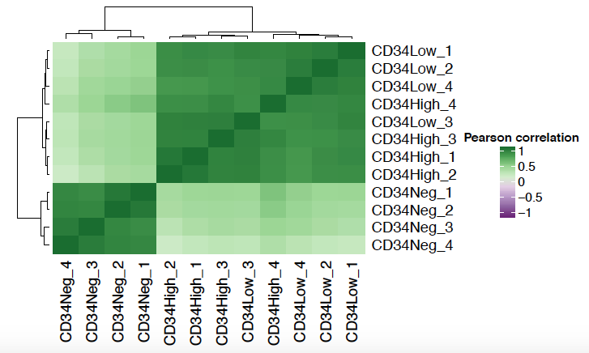
2.  **Sample CVs Plots**: A plot representing distribution of protein
    level coefficient of variation for each condition. Each plot also
    contains a vertical line representing median CVs percentage withing
    that condition. 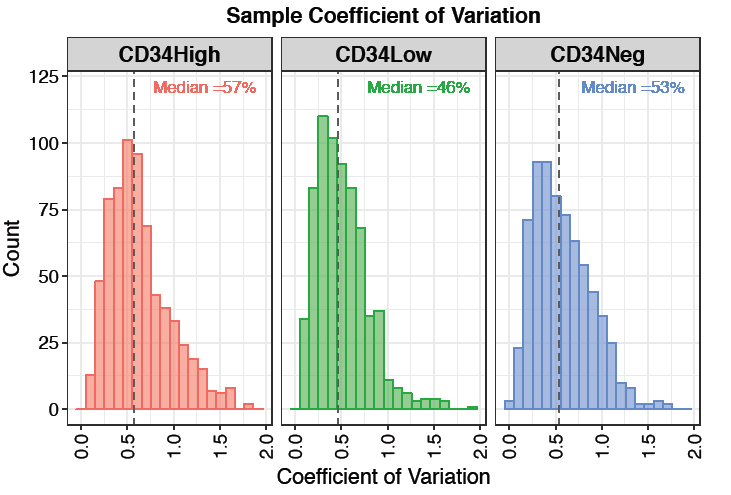
3.  **Protein Numbers**: A bar-plot representing number of proteins
    identified and quantified in each sample.
    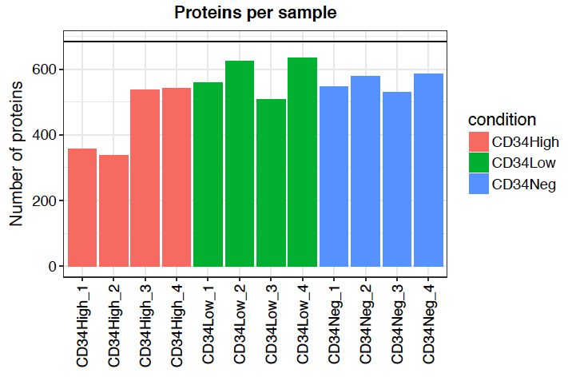
4.  **Sample coverage**: A plot highlighting overlap between identified
    proteins across all samples in the experiment.
    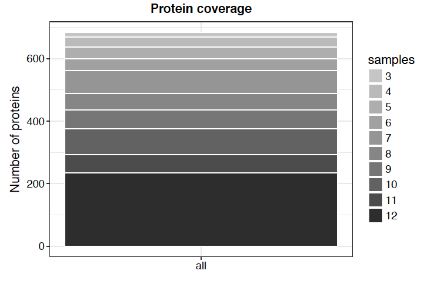
5.  **Normalization**: Two plots representing the effect of variant
    stabilising normalisation (vsn) method on protein intensity
    distribution in each sample. **Note**: As MaxQuant protein intensity
    is already been normalised using MaxLFQ algorithm, further
    normalisation is not done during data analysis. This plot is just
    for visualisation puporse.  
6.  **Missing values- Quant**: To check whether missing values are
    biased to lower intense proteins, the densities and cumulative
    fractions are plotted for proteins with and without missing values.
    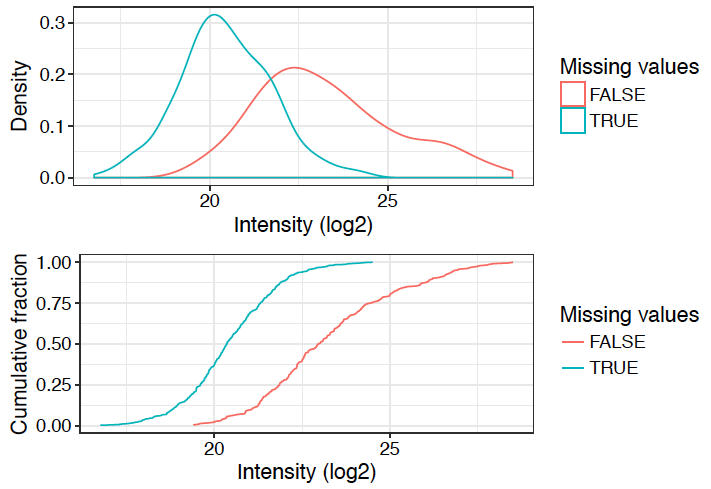
7.  **Missing values- Heatmap**: To explore the pattern of missing
    values in the data, a heatmap is plotted indicating whether values
    are missing (0) or not (1). Only proteins with at least one missing
    value are visualized. 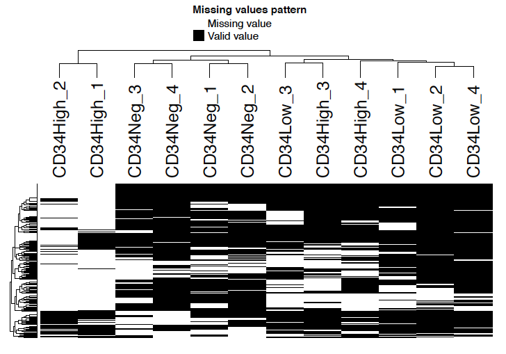
8.  **Imputation**: A desity plot of protein intensity (log2)
    distrubution for each condition after and before missing value
    imputation being performed. 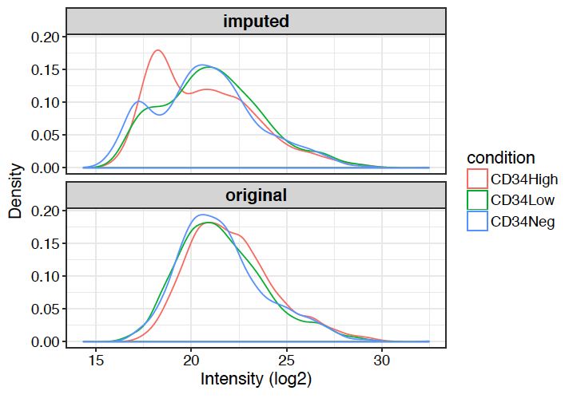
9.  ***p-value* Histogram**: A histogram of p-value distribution for all
    the proteins across all pairwise comparison.
    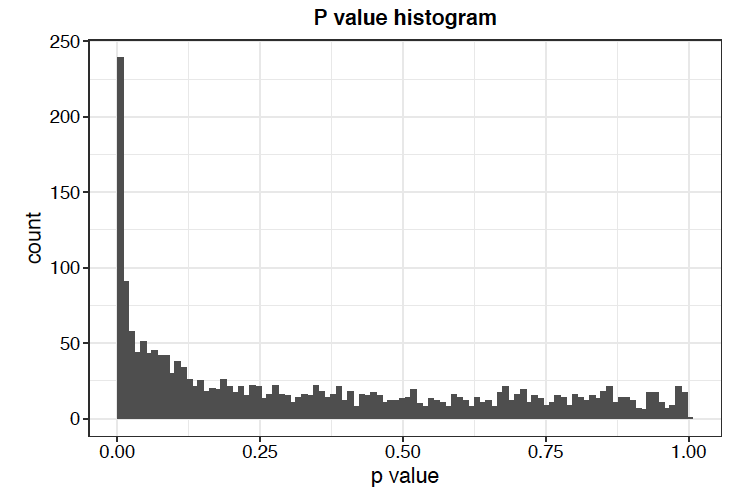

#### Download options

-   **Download tables** (csv format)

1.  Results: Same as *LFQ Results Table*
2.  Unimputed data matrix: Original protein intensities before
    imputation in each sample.
3.  Imputed data matrix: Protein intensities after performing selected
    imputaion method
4.  Full results: Combined table of all above data outputs i.e. with and
    without imputation information along with fold change and p-values.

-   **Download Report** (word format) A summary report document
    including some statistics and plots.

-   **Download Plots** (PDF format) A PDF document containing all the
    plots generated during the analysis.
